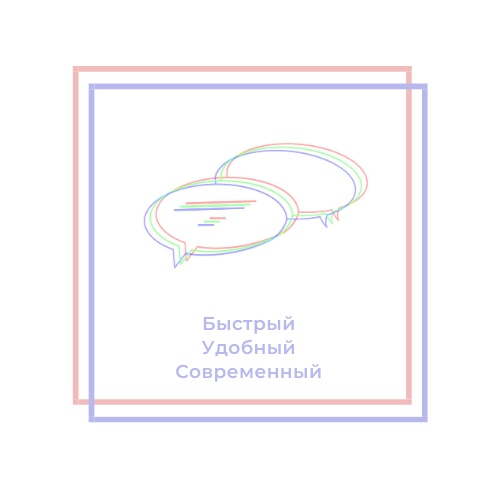

<!-- PROJECT SHIELDS -->
[![Contributors][contributors-shield]][contributors-url]
[![Forks][forks-shield]][forks-url]
[![Stargazers][stars-shield]][stars-url]
[![Issues][issues-shield]][issues-url]
[![MIT License][license-shield]][license-url]

<!-- PROJECT LOGO -->
<br />
<p align="center">
  <a href="https://github.com/vladiiii/Quizy">
    
  </a>

  <h3 align="center">Best messanger in the world</h3>

  <p align="center">
    An awesome Messanger to jumpstart your projects!
    <br />
    <a href="https://github.com/vladiiii/Quizy"><strong>Explore the docs »</strong></a>
    <br />
    <br />
    <a href="https://github.com/vladiiii/Quizy">View Demo</a>
    ·
    <a href="https://github.com/vladiiii/Quizy/issues">Report Bug</a>
    ·
    <a href="https://github.com/vladiiii/Quizy/issues">Request Feature</a>
  </p>
</p>


<!-- TABLE OF CONTENTS -->
<details open="open">
  <summary>Table of Contents</summary>
  <ol>
    <li>
      <a href="#about-the-project">About The Project</a>
      <ul>
        <li><a href="#built-with">Built With</a></li>
      </ul>
    </li>
    <li>
      <a href="#getting-started">Getting Started</a>
      <ul>
        <li><a href="#prerequisites">Prerequisites</a></li>
        <li><a href="#installation">Installation</a></li>
      </ul>
    </li>
    <li><a href="#roadmap">Roadmap</a></li>
    <li><a href="#contributing">Contributing</a></li>
    <li><a href="#license">License</a></li>
    <li><a href="#contact">Contact</a></li>
    <li><a href="#acknowledgements">Acknowledgements</a></li>
  </ol>
</details>


<!-- ABOUT THE PROJECT -->
## About The Project

This is a great product that were developed by a proffesoionals during their 4th year in study

Here's why:
* Our manager were Anya, that did a lot of work during conversations
* Vlady coded well and and Leha code reviewed and made tests
* Andruha and Vanya helped a lot with db and overall ideas during development

Of course, it's still working in progress, but you'll like it for sure!

### Built With

* [Django](https://www.djangoproject.com/)


<!-- GETTING STARTED -->
## Getting Started


### Prerequisites

* Install all needed requirements using requirements.txt
  ```sh
    python -m pip install requirements.txt
  ```

### Installation

1. Clone the repo
   ```sh
   git clone https://github.com/https://github.com/vladiiii/Quizy
   ```
2. Install all needed requirements using requirements.txt
   ```sh
   python -m pip install requirements.txt
   ```
3. Run server using `Django`
   ```sh
   python manage.py runserver
   ```

## Roadmap

See the [open issues](https://github.com/vladiiii/Quizy/issues) for a list of proposed features (and known issues).

## Contributing

Contributions are what make the open source community such an amazing place to be learn, inspire, and create. Any contributions you make are **greatly appreciated**.

1. Fork the Project
2. Create your Feature Branch (`git checkout -b feature/AmazingFeature`)
3. Commit your Changes (`git commit -m 'Add some AmazingFeature'`)
4. Push to the Branch (`git push origin feature/AmazingFeature`)
5. Open a Pull Request


## License

Distributed under the MIT License. See `LICENSE` for more information.


## Contacts

Vlady - [@vladiiii](https://github.com/vladiiii)
Leha - [@eskelai](https://github.com/eskelai)
Andruha -
Anya - 
Vanya -

Project Link: [Quizy](https://github.com/vladiiii/Quizy)


<!-- ACKNOWLEDGEMENTS -->
## Acknowledgements
* [Img Shields](https://shields.io)
* [Choose an Open Source License](https://choosealicense.com)
* [GitHub Pages](https://pages.github.com)
* [othneildrew README](https://github.com/othneildrew/Best-README-Template)


<!-- MARKDOWN LINKS & IMAGES -->
<!-- https://www.markdownguide.org/basic-syntax/#reference-style-links -->
[contributors-shield]: https://img.shields.io/github/contributors/vladiiii/Quizy.svg?style=for-the-badge
[contributors-url]: https://github.com/vladiiii/Quizy/graphs/contributors
[forks-shield]: https://img.shields.io/github/forks/vladiiii/Quizy.svg?style=for-the-badge
[forks-url]: https://github.com/vladiiii/Quizy/network/members
[stars-shield]: https://img.shields.io/github/stars/vladiiii/Quizy.svg?style=for-the-badge
[stars-url]: https://github.com/vladiiii/Quizy/stargazers
[issues-shield]: https://img.shields.io/github/issues/vladiiii/Quizy.svg?style=for-the-badge
[issues-url]: https://github.com/vladiiii/Quizy/issues
[license-shield]: https://img.shields.io/github/license/vladiiii/Quizy.svg?style=for-the-badge
[license-url]: https://github.com/vladiiii/Quizy/blob/master/LICENSE.txt
[product-screenshot]: images/screenshot.png
